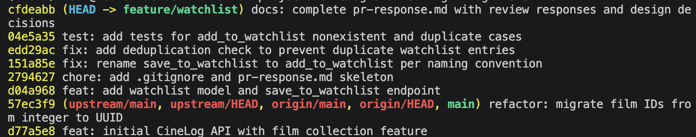

# PR Response Doc — CineLog Watchlist Feature

## AI Usage
I used Claude Code in two ways during this project:

1. **Codebase orientation.** Before reading the review comments, I had Claude summarize `models.py`, `services/collection_service.py`, and `tests/test_collection.py` — what patterns each file established (naming, dedup, fixture structure). I verified each summary against the actual code before trusting it. This is what let me address Comments 1–3 quickly: the patterns to mirror were already clear.

2. **Stress-testing my design responses (Comments 4 & 5).** After drafting each position, I had Claude argue the opposite side — what would a maintainer say back? For Comment 4, the strongest counter was that the per-entry `public` flag isn't a real mitigation because the median user never touches it — which is why I now acknowledge that in the tradeoff section and propose surfacing the flag at add-time. For Comment 5, the counter was that "consistency is a proxy for predictability" — which pushed me to name that framing explicitly instead of dismissing consistency as a value.

The design positions themselves are mine; Claude's job was to poke holes, not to write the argument.

## Commit history



## Comment 1 — Rename
**What I did:**
Renamed `save_to_watchlist()` → `add_to_watchlist()` in `services/watchlist_service.py` to match the project's `verb_to_noun` convention already established by `add_to_collection()` / `remove_from_collection()`. Updated the sole call site in `routes/watchlist/watchlist.py` (both the import and the invocation).

**How I verified:**
`grep -rn "save_to_watchlist" --include="*.py" .` returned zero results after the change. Full suite still passes (`pytest tests/ -v`).

## Comment 2 — Deduplication
**What I did:**
Added a `AlreadyInWatchlistError` exception and a duplicate check in `add_to_watchlist()`, mirroring the pattern in `add_to_collection()`: after the `FilmNotFoundError` check, query `WatchlistEntry` for `(user_id, film_id)` and raise if one exists — rather than relying on a DB-level `UniqueConstraint` alone.

**How I verified:**
Read `services/collection_service.py::add_to_collection` first — its dedup runs a `filter_by(...).first()` and raises `AlreadyInCollectionError` before hitting the DB integrity error. Mirrored that. Added a test in `tests/test_watchlist.py` for the duplicate case (see Comment 3 / stretch tests). `pytest tests/ -v` green.

## Comment 3 — Missing test
**What I did:**
Created `tests/test_watchlist.py` following the fixture and assertion style of `tests/test_collection.py` (same `app`, `sample_user`, `sample_film` fixtures). Wrote `test_add_to_watchlist_nonexistent_film_raises` as the direct equivalent of `test_add_to_collection_nonexistent_film_raises` — passes a UUID that isn't in the DB and asserts `FilmNotFoundError`.

**How I verified:**
`pytest tests/test_watchlist.py -v` — the new test passes; `pytest tests/ -v` — full suite green.

## Comment 4 — Default visibility
**My position:**
Keep `public=True` as the default for `WatchlistEntry`.

**Reasoning:**
CineLog is described in the README as a *community* film tracking app, and the existing `CollectionEntry` (what a user has already watched) has no visibility flag at all — it's implicitly public. A watchlist is aspirational: it says "here's what I want to watch next." I feel like this is what makes friend-driven discovery work — someone sees I've added *The Zone of Interest* and messages me so we can watch it together, or a maintainer sees the top ten items and knows what to do next. If we switched the toggle I feel like it'll lose its essence/value of being a social feature — it would just be an isolated to-do list.

**Tradeoff acknowledged:**
Some understandable tradeoff will be the privacy aspect of it. People just don't want others to see their watch history for various reasons. The mitigation for this will be to toggle individual items to private since the `public` field already exists. If we want to take the privacy concern more seriously without changing the default, we should (a) surface the `public` flag in the `add` endpoint so callers can opt out per-add without a second request, and (b) consider a user-level "default to private" preference in a follow-up PR. Neither of those requires reversing the current default.

## Comment 5 — Sort order
**My position:**
Keep the alphabetical (`Film.title.asc()`) sort in `get_watchlist`. I don't think consistency with `get_collection`'s date-added ordering is the right kind of consistency here.

**Reasoning:**
The two views answer different questions. `get_collection` is a *history log* — "what have I watched?" — where chronology is the primary axis; the newest entry is the freshest data point and belongs at the top. `get_watchlist` is a *browse menu* — "what should I watch tonight?" — where the user is scanning for a title, not reviewing recent activity. Alphabetical order makes it easier because it gives an easily predictable location. If I added one that starts with an A, I can expect it to be at the top. Date-added-desc buries older adds under whatever I bookmarked last week, which is exactly the wrong bias for a "pick something to watch" workflow — the films I've been meaning to watch the longest sink out of sight.

**Engagement with reviewer's point:**
The reviewer's argument is consistency-across-services, which makes sense. But consistency isn't a goal on its own. Two functions that return the same shape of data but serve different user intents can — and often should — sort differently, and pretending they're the same for the sake of tidiness will make the feature less useful. If we want to fully close the loop, I'd propose adding a `?sort=date_added|title` query param to `GET /watchlist/<user_id>` in a follow-up (defaulting to `title`) so users who *do* think of their watchlist chronologically aren't shut out. That gives us the flexibility without forcing everyone onto the history-log model.

## Comment 6 — Rebase
**What conflicted:**
`models.py` — the main branch changed `Film.id` and `CollectionEntry.film_id` to `String(36)` UUIDs; my feature branch still had them as `Integer` and defined `WatchlistEntry.film_id` as `Integer`. Also `services/watchlist_service.py` and `routes/watchlist/watchlist.py` referenced integer IDs in docstrings/comments.

**How I resolved it:**
`git fetch origin && git rebase origin/main`. For each conflict I took main's UUID version of `Film.id` and `CollectionEntry.film_id`, and updated `WatchlistEntry.film_id` from `Integer` to `String(36)` to match. Updated docstrings/type hints in the watchlist service and route from `int` → `str` (UUID). No merge commits — the branch is linear.

**How I verified no conflict remains:**
`git status` clean, `git log --oneline --graph` shows no merge nodes, `pytest tests/ -v` still green after the rebase.

## PR Description

### What this PR adds
A watchlist feature: users can save films they want to watch (as opposed to films they've already watched, which live in `CollectionEntry`). Adds a `WatchlistEntry` model with a per-entry `public` visibility flag, `add_to_watchlist` / `get_watchlist` service functions with deduplication, and two REST endpoints: `GET /watchlist/<user_id>` and `POST /watchlist/<user_id>/add`.

### Design decisions
- **Default visibility is `public=True`.** CineLog is a community film-tracking app and `CollectionEntry` is already implicitly public. A private-by-default watchlist would degrade the discovery value for the median user (who never touches the toggle). Full reasoning in Comment 4 above.
- **`get_watchlist` sorts alphabetically by title, not by date-added.** The watchlist is a browse menu ("what should I watch tonight?"), not a history log ("what have I watched?"). Alphabetical order gives titles a predictable location and prevents older adds from being buried under recent ones. This deliberately diverges from `get_collection`'s date-added-desc sort. Full reasoning in Comment 5 above.

### Manual testing
1. Set up: `python -m venv .venv && source .venv/bin/activate && pip install -r requirements.txt`
2. Seed the DB: `python seed.py`
3. Run the app: `python app.py` — listens on `http://127.0.0.1:5000`
4. Grab a user and film UUID from the seed output, then:
   ```bash
   # Add a film to the watchlist
   curl -X POST http://127.0.0.1:5000/watchlist/<user_id>/add \
        -H "Content-Type: application/json" \
        -d '{"film_id": "<film_id>"}'
   # → 201 with the new entry

   # Try to add the same film again — should reject
   curl -X POST http://127.0.0.1:5000/watchlist/<user_id>/add \
        -H "Content-Type: application/json" \
        -d '{"film_id": "<film_id>"}'
   # → raises AlreadyInWatchlistError (500 with traceback in debug)

   # View the watchlist (sorted alphabetically by title)
   curl http://127.0.0.1:5000/watchlist/<user_id>
   ```
5. Automated tests: `pytest tests/ -v` — 6 tests pass (4 collection, 2 watchlist).
